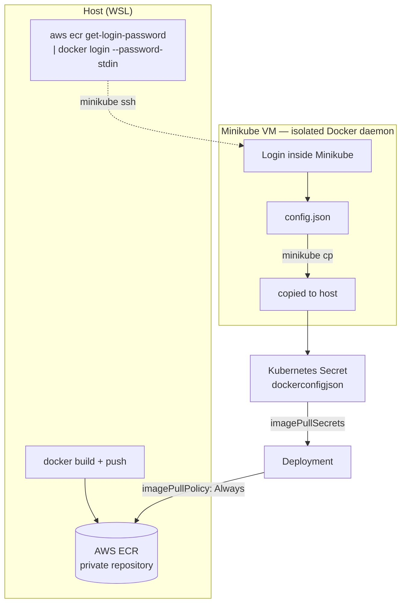

# Kubernetes — Deploy from a Private AWS ECR Registry

> **FR** — Déploiement d'une application Node.js conteneurisée sur Kubernetes (Minikube) en tirant l'image depuis un registre privé AWS ECR. Authentification via un Secret Kubernetes de type `dockerconfigjson`, avec deux méthodes de création et analyse du daemon Docker isolé de Minikube.
>
> **EN** — Deployment of a containerized Node.js application on Kubernetes (Minikube) by pulling the image from a private AWS ECR registry. Authentication is handled via a Kubernetes `dockerconfigjson` Secret, covering two creation methods and an analysis of Minikube's isolated Docker daemon.


---

## Problem

`docker login` on your laptop doesn't help Kubernetes pull a private image — the cluster's container runtime authenticates independently, and if that runtime is Minikube's own isolated Docker daemon, it doesn't even see your host's credentials. Add a registry that issues short-lived tokens (ECR: 12 hours) and "it worked when I tested it" stops being good enough.

## Solution

The image is built and pushed to a private ECR repository, then pulled into Kubernetes via a `dockerconfigjson` Secret referenced in `imagePullSecrets`. Because Minikube runs its own isolated Docker daemon that doesn't share the host's `~/.docker/config.json`, the ECR login has to happen *inside* Minikube (via `minikube ssh`), with the resulting credentials file copied back out (`minikube cp`) to build the Kubernetes Secret from. Two Secret-creation methods are implemented and validated side by side.

## Architecture



## Skills demonstrated

- Diagnosing and working around a real infrastructure quirk (Minikube's daemon isolation) instead of assuming Docker credentials are always host-wide
- Both `dockerconfigjson`-from-file and direct-credential Secret creation methods, and knowing when each applies (multi-registry vs single-registry)
- Understanding Secret scoping (namespace-local) and token expiry (ECR: 12h) as operational realities, not edge cases
- Validating a deployment through the actual event sequence (`kubectl describe pod`: `Pulling` → `Pulled` → `Started`) rather than just "it's running"

## Key technical decisions

| Decision | Why |
|---|---|
| Docker inline credentials (`auths` in `config.json`) instead of a credential store (`credsStore`) | Only the inline format can be base64-encoded directly into a Kubernetes `dockerconfigjson` Secret; external credential stores don't expose the token the same way. |
| `--password-stdin` for ECR login | Keeps the token out of shell history, unlike passing it as a CLI argument. |
| `imagePullPolicy: Always` | Forces a fresh pull on every pod start so a stale locally-cached image is never silently reused. |

## Limitations

- ECR tokens expire after 12 hours; there is no automated refresh (a CronJob rotating the Secret would be the production fix).
- Tested on Minikube only — a managed cluster (EKS) with IRSA would use a different, credential-less pull mechanism entirely.

## Roadmap

- [ ] Add a CronJob that refreshes the ECR-backed Secret before the 12-hour token expiry
- [ ] Document the IRSA-based alternative for EKS (no Secret needed at all) as a comparison

---

## FR — Détails d'implémentation

### Build et push vers AWS ECR

L'image est taguée avec l'URI complète du registre. L'authentification ECR se fait via `aws ecr get-login-password | docker login --username AWS --password-stdin <uri>`. Docker doit être configuré en mode credentials inline plutôt qu'avec un credential store externe — seul le mode inline permet de créer un Secret Kubernetes valide.

### Daemon Docker isolé de Minikube

Minikube exécute son propre daemon Docker dans une VM isolée et ne partage pas le `~/.docker/config.json` de l'hôte. L'accès au daemon interne se fait via `minikube ssh`. Après le login ECR depuis l'intérieur de Minikube, le `config.json` généré est copié vers l'hôte avec `minikube cp`.

### Création du Secret Kubernetes

Deux méthodes : depuis `config.json` (encodage base64 + manifest YAML, ou `kubectl create secret generic --from-file`), ou credentials directs (`kubectl create secret docker-registry`). Les tokens ECR expirent après 12 heures.

### Déploiement avec `imagePullSecrets`

Le Secret est référencé dans le manifest Deployment. `imagePullPolicy: Always` force un pull à chaque démarrage de pod. Validation via `kubectl describe pod`.

## EN — Implementation Details

### Build and Push to AWS ECR

The image is tagged with the full registry URI. ECR authentication uses `aws ecr get-login-password | docker login --username AWS --password-stdin <uri>`. Docker must use inline credential storage rather than an external credential store — only inline credentials work for creating a valid Kubernetes Secret.

### Minikube's Isolated Docker Daemon

Minikube runs its own Docker daemon inside an isolated VM and does not share the host's `~/.docker/config.json`. The internal daemon is accessed via `minikube ssh`. After logging in to ECR from inside Minikube, the generated `config.json` is copied to the host via `minikube cp`.

### Creating the Kubernetes Secret

Two methods: from `config.json` (base64-encode + YAML manifest, or `kubectl create secret generic --from-file`), or direct credentials (`kubectl create secret docker-registry`). ECR tokens expire after 12 hours.

### Deployment with `imagePullSecrets`

The Secret is referenced in the Deployment manifest. `imagePullPolicy: Always` forces a fresh pull on every pod start. Validated via `kubectl describe pod`.

---

## Prerequisites

- Minikube, `kubectl`, `aws-cli` with ECR access

## Project Structure

```
.
├── Dockerfile          # Node.js app image
├── app/                # Application source
├── deployment.yaml     # Deployment referencing imagePullSecrets
└── docker-secret.yaml  # dockerconfigjson Secret template
```
